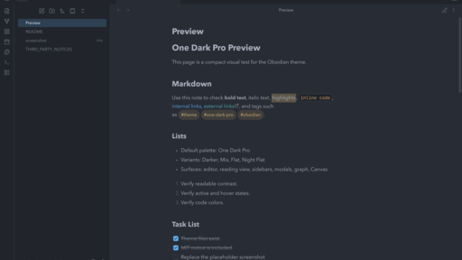

# One Dark Pro for Obsidian

An Obsidian app theme that brings the One Dark Pro family of dark palettes to
notes, Markdown previews, code blocks, sidebars, tabs, Canvas, graph view, and
common editor surfaces.

This theme is inspired by and adapts palette decisions from
[Binaryify/OneDark-Pro](https://github.com/Binaryify/OneDark-Pro), which is
licensed under MIT. The upstream notice is preserved in
[THIRD_PARTY_NOTICES.md](THIRD_PARTY_NOTICES.md).

## Palettes

The default palette is One Dark Pro. If the
[Style Settings](https://github.com/mgmeyers/obsidian-style-settings) plugin is
installed, the theme exposes these palette variants:

- One Dark Pro
- One Dark Pro Darker
- One Dark Pro Mix
- One Dark Pro Flat
- One Dark Pro Night Flat

Like Catppuccin for Obsidian, One Dark Pro is installed as a single Obsidian
theme. The variants are selected from **Style Settings**, not from Obsidian's
theme picker.

## Installation

### From Obsidian Community Themes

After the theme is accepted into the community directory:

1. Open Obsidian settings.
2. Go to **Appearance**.
3. Select **Manage** next to **Themes**.
4. Search for **One Dark Pro**.
5. Install and use the theme.

### Manual installation

1. Create a folder named `One Dark Pro` in your vault's `.obsidian/themes/`
   directory.
2. Copy `manifest.json` and `theme.css` into that folder.
3. Restart Obsidian.
4. Select **One Dark Pro** from **Settings > Appearance > Themes**.

### Palette selection

1. Install and enable the Style Settings community plugin.
2. Open **Settings > Style Settings > One Dark Pro**.
3. Select a palette from **Palette**.

## Release checklist

Before submitting to the Obsidian community directory:

- Commit `manifest.json`, `theme.css`, `README.md`, `LICENSE`, and a real
  `512 x 288` screenshot.
- Create a GitHub release whose tag matches `manifest.json`'s `version`.
- Upload `manifest.json` and `theme.css` as release assets.
- Submit the repository URL at <https://community.obsidian.md>.

## License

MIT. See [LICENSE](LICENSE) and [THIRD_PARTY_NOTICES.md](THIRD_PARTY_NOTICES.md).
